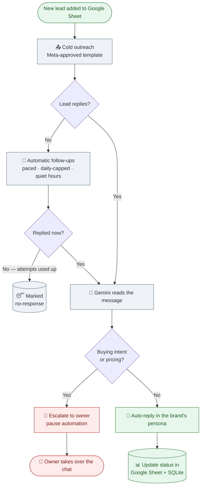
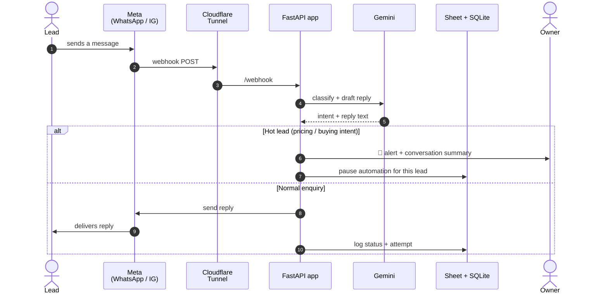
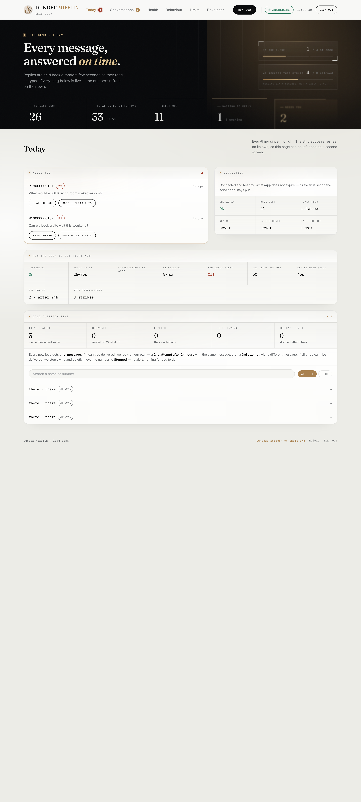
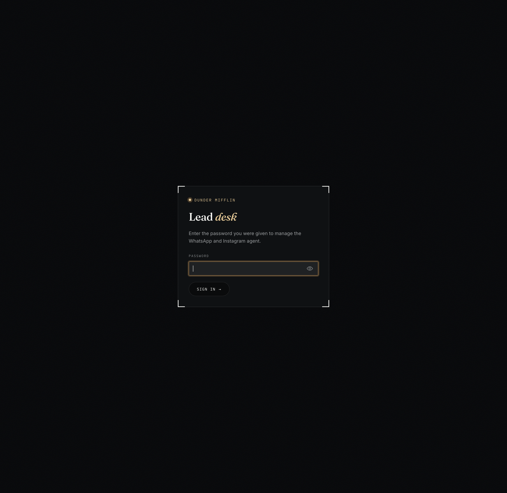
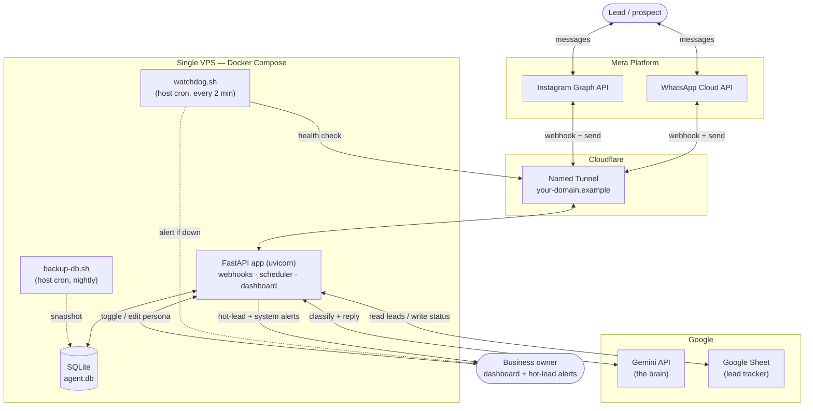

# LeadPilot AI — AI agent for social media management

An always-on conversational agent that answers inbound WhatsApp and Instagram
messages for a small business, runs paced cold-outreach and follow-up campaigns,
tracks every lead in a Google Sheet, and hands hot leads to a human — with a
password-protected dashboard for the business owner and a self-healing
reliability layer on the host.

Built with FastAPI, Google's Gemini as the conversational brain, SQLite for
state, and a Cloudflare named tunnel for a stable public HTTPS webhook. It runs
as two Docker containers on a single small VPS.

> **Status:** production. Reply loop, cold outreach, follow-ups, retries,
> escalation, dashboard, monitoring and backups are all live.

---

## How a lead flows through it

The whole point of the system in one picture — from a name in a spreadsheet to
either a booked conversation with the owner or a clean "no response" record.



## What happens the moment a message arrives



---

## The owner's dashboard

One URL and one password. No terminal, no Meta dashboard — live counts, the
hot-lead inbox, an on/off switch for outbound messaging and an editable persona
prompt. The screenshots below show the actual interface rendered with demo data
(no real leads, numbers or conversations).





---

## What it does

- **Answers inbound messages** on WhatsApp and Instagram with the same brain,
  pacing and persona — one codebase, two transports.
- **Runs cold outreach** from a Google Sheet of leads, using Meta-approved
  message templates, with a hard daily cap, quiet-hours windows and pacing
  between sends to protect the number's quality rating.
- **Follows up automatically** on leads who don't reply, across a configurable
  number of attempts and back-off intervals, then marks them as no-response.
- **Escalates hot leads to a human.** When the model detects buying intent or a
  question it shouldn't answer alone (e.g. pricing), it alerts the owner with a
  summary and pauses automation for that lead.
- **Tracks every lead** — status, attempt count, last contact — in a Google
  Sheet the owner already understands, with SQLite as the source of truth for
  runtime state.
- **Gives the owner a dashboard** — a URL and a password. Live counts, the
  hot-lead inbox, an on/off switch for outbound messaging, and an editable
  persona prompt. No terminal, no Meta dashboard.
- **Watches and heals itself** — a host-side watchdog alerts the developer on
  WhatsApp if the whole chain goes down, and nightly rotating backups snapshot
  the database safely while the app is live.

---

## Architecture



The public health URL sits at the far edge, so a passing check means the whole
chain is up: Cloudflare → tunnel → app. Secrets are never baked into the image —
`.env` and the Google service-account key are bind-mounted at runtime.

## Tech stack

| Layer | Choice | Why |
|---|---|---|
| API / server | FastAPI + uvicorn | async webhooks and an in-process scheduler in one process |
| Brain | Google Gemini | classification + reply generation from an editable persona prompt |
| State | SQLite (`data/agent.db`) | correct and durable at this scale — one writer, hundreds of leads |
| Lead tracker | Google Sheets (gspread) | the owner already lives in a spreadsheet |
| Public URL | Cloudflare named tunnel | stable HTTPS webhook with no open port on the VPS |
| Packaging | Docker Compose | app container + tunnel container, `restart: unless-stopped` |
| Runtime | Python 3.12-slim | prebuilt wheels only, small image, smaller attack surface |

## Key endpoints

| Method | Path | Purpose |
|---|---|---|
| `GET` | `/webhook`, `/webhook/instagram` | Meta webhook verification |
| `POST` | `/webhook`, `/webhook/instagram` | inbound messages + delivery-status events |
| `POST` | `/run-campaign` | trigger a cold-outreach pass manually |
| `POST` | `/run-followups` | trigger a follow-up pass manually |
| `POST` | `/run-cold-retries` | trigger the retry pass manually |
| `GET` | `/health` | liveness check (what the watchdog polls) |

An in-process scheduler (`SCHEDULER_ENABLED=true`) runs the cold, follow-up and
retry passes on an interval that can be changed live from the dashboard without
a restart.

## Project structure

```
main.py              FastAPI app: webhooks, delivery-status handling, scheduler loop
brain.py             Gemini prompt/response — classification + reply generation
jobs.py              Phase 2 engine: cold batches, follow-ups, retries + safety rails
campaign.py          CLI wrapper for manual one-off outreach runs
escalation.py        hot-lead detection and owner hand-off
sheets.py            Google Sheets read/write (pending leads, statuses, follow-ups)
store.py             SQLite-backed settings + live-adjustable dashboard config
whatsapp_client.py   WhatsApp Cloud API transport
instagram_client.py  Instagram Graph API transport
dashboard.py         password-protected owner control panel (routes)
dashboard_view.py    dashboard HTML/CSS
config.py            env loader — every secret comes from .env, never hardcoded
watchdog.sh          host-side uptime monitor → WhatsApp alert on outage
backup-db.sh         nightly live-safe SQLite snapshot + 14-day rotation
docker-compose.yml   app container + Cloudflare tunnel container
.env.client.example  the config template you copy to .env and fill in
```

## Configuration

Everything sensitive is read from `.env` at runtime — nothing is hardcoded and
nothing secret is committed. Copy the template and fill it in:

```bash
cp .env.client.example .env
# then edit .env with your own tokens, IDs and passwords
```

See `.env.client.example` for the full, commented list. The values you must
provide are your Meta WhatsApp/Instagram tokens and IDs, a webhook verify
string, your Gemini API key, a Google service-account JSON (`gcreds.json`), the
lead sheet ID, the owner's WhatsApp number, a dashboard password, and your
approved template names.

## Running it

Local reply-loop smoke test (no live accounts touched):

```bash
python3 test_agent.py
```

Production (on the VPS):

```bash
docker compose up -d
docker compose logs -f agent
```

The tunnel container publishes the app at your Cloudflare hostname; point your
Meta app's webhook at `https://<your-domain>/webhook` with your verify token and
subscribe to `messages`.

## Reliability

Two host-level safety nets run outside Docker so they survive a container crash:

- **Uptime watchdog** (`watchdog.sh`, host cron every 2 min) polls the public
  health URL. After three consecutive failures it sends a WhatsApp alert via an
  approved template — which delivers regardless of the 24-hour messaging window —
  and one more when the service recovers. `restart: unless-stopped` brings the
  app back; the watchdog is what tells you, and it catches crash-loops the
  restart policy alone would hide.
- **Nightly backups** (`backup-db.sh`, host cron) take a consistent online
  snapshot of the SQLite database from inside the container — safe while the app
  is live, no corruption risk a plain copy carries — then compress it and keep
  the newest 14 days.

## Limitations & honest trade-offs

- **Single VPS, single point of failure.** No load balancer or failover. If the
  droplet dies, the agent is down until it's restored — the watchdog tells you,
  but recovery is manual. This is a deliberate cost/complexity trade-off for a
  small-business workload, not an oversight.
- **SQLite, not a client-server database.** Correct and fast at this scale (one
  process, one writer, hundreds of leads). It is *not* suited to horizontal
  scaling or multiple app instances — that would require moving to Postgres.
- **Bound to one WhatsApp number and one Meta app.** Tokens, phone-number IDs
  and approved templates are tied to a specific Meta Business Account; the agent
  is not multi-tenant.
- **Message templates gate cold outreach.** Every business-initiated template
  must be approved by Meta before it can send, and a new number starts on the
  lowest messaging tier and must be warmed up gradually. The code enforces a
  daily cap and pacing, but it cannot bypass Meta's own limits or review queues.
- **The brain is an LLM.** Replies are generated, so tone and correctness depend
  on the persona prompt and the model. Anything sensitive (notably pricing) is
  routed to a human rather than answered automatically, but the classifier is
  not infallible — escalation is tuned to err toward involving a person.
- **Graph API version pinning.** Meta deprecates Graph API versions on a rolling
  cycle; the pinned version needs bumping roughly every couple of years.
- **Not a spam tool.** Quiet-hours windows, opt-out handling and a hard daily
  cap are built in on purpose. Removing them is the fastest way to get a number
  banned, and the design assumes you won't.

## Security notes

This repository is deliberately scrubbed for public release: all secrets, the
live database, real lead data, and operational documents containing production
infrastructure identifiers are excluded via `.gitignore` and are **not** part of
this repo. Provide your own via `.env` and `gcreds.json`. Never commit those.

## License

No license is granted by default — all rights reserved unless a `LICENSE` file
is added. If you want others to reuse this, add an OSI-approved license (MIT is
the common choice for a project like this).

